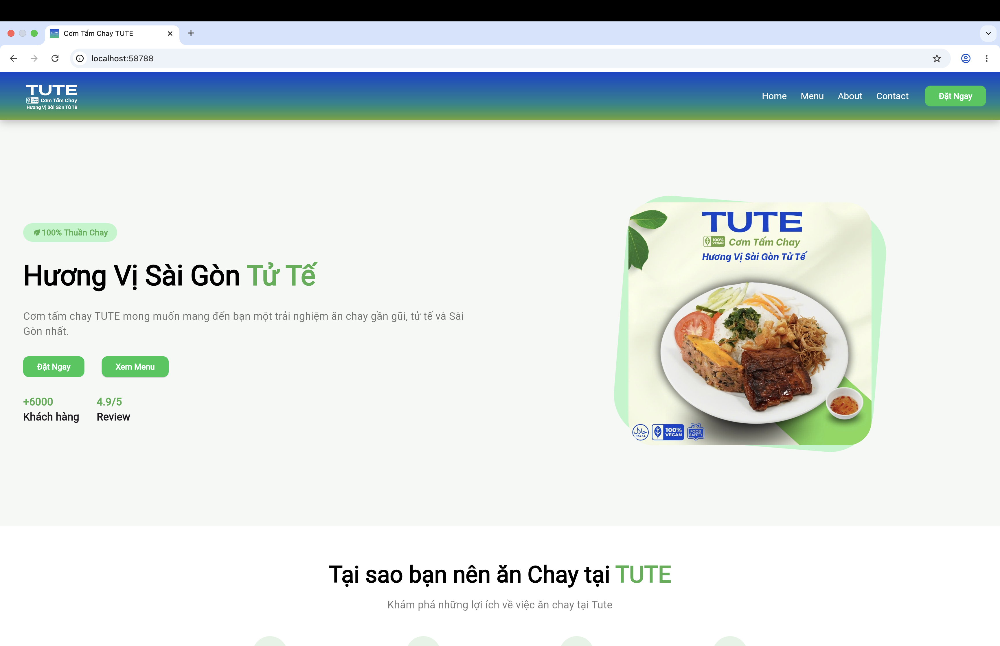
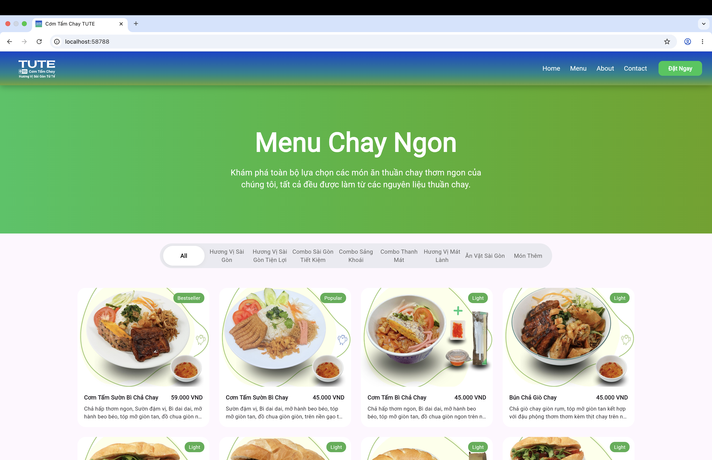

# TUTE - Vegan Restaurant Website

A responsive restaurant website built with Flutter Web, designed to introduce the TUTE vegan brand, menu, and ordering platforms.

+ Features

- Responsive UI for Desktop / Tablet / Mobile
- Drawer navigation for mobile devices
- Menu showcase
- Contact form integration with EmailJS
- External ordering links:
  - ShopeeFood
  - GrabFood
  - BeFood
  - GreenSM
- Responsive hero sections and reusable widgets
- Deployment with Vercel

+ Tech Stack

- Flutter Web
- Dart
- EmailJS
- Git & GitHub
- Vercel

+ Preview

- Homepage



- Menu Page



- Mobile Drawer


🍎 macOS Setup (Optional)

- Install Flutter:

brew install --cask flutter
flutter --version

- Install Xcode tools:
sudo xcode-select --switch /Applications/Xcode.app/Contents/Developer
sudo xcodebuild -runFirstLaunch
sudo xcodebuild -license

- Install CocoaPods:
sudo gem install cocoapods
pod setup

- Accept Android licenses:
flutter doctor --android-licenses

- If command fails:
~/Library/Android/sdk/cmdline-tools/latest/bin/sdkmanager --licenses

- Common Fixes

Fix: cmdline-tools component is missing

- Open:
Android Studio
Preferences
Android SDK
SDK Tools

- Enable:

Android SDK Command-line Tools
Android SDK Build-Tools
Android SDK Platform-Tools

Fix: Android license status unknown

- flutter doctor --android-licenses


+ Live Demo

Website:

https://tute-flutter-web-c85c.vercel.app/

+ Source Code

GitHub Repository:

https://github.com/lkjhg612/tute-flutter-web.git

+Run locally (mac)

Clone repository:

```bash
git clone https://github.com/lkjhg612/tute-flutter-web.git
```

Install dependencies:

```bash
flutter pub get
```

Run project:

```bash
flutter run -d chrome
```

Build production:

```bash
flutter build web --release
```

+Notes

This project was created to practice:

- Responsive UI design
- Flutter Web development
- Deployment workflow
- Email integration
- Git/GitHub version control

---

Made with Flutter ❤️